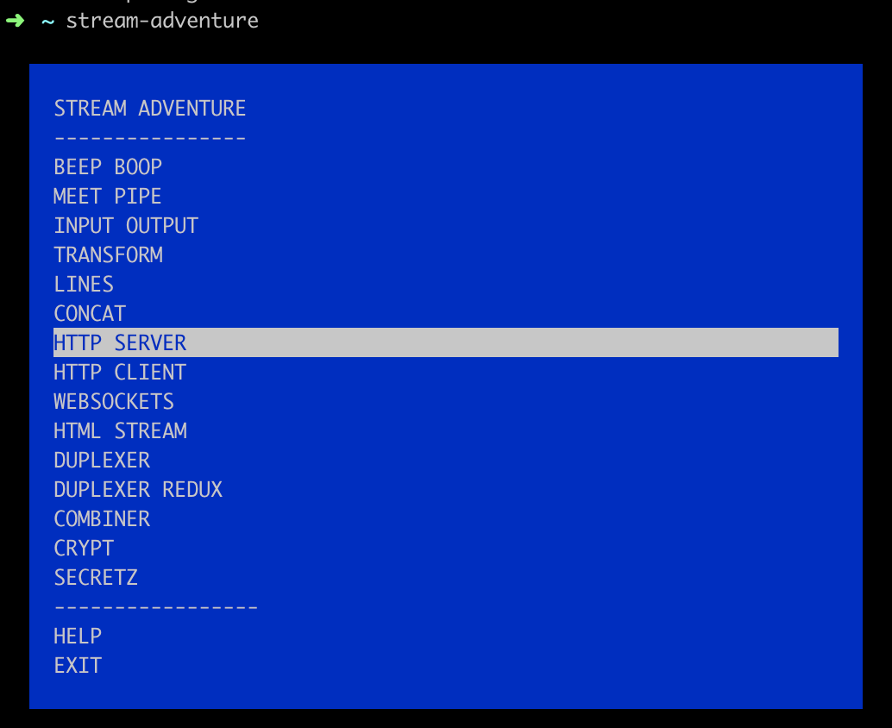
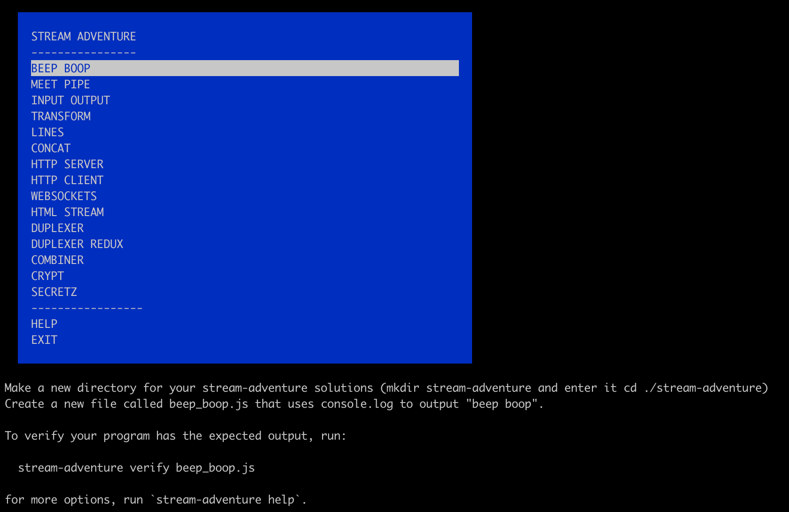
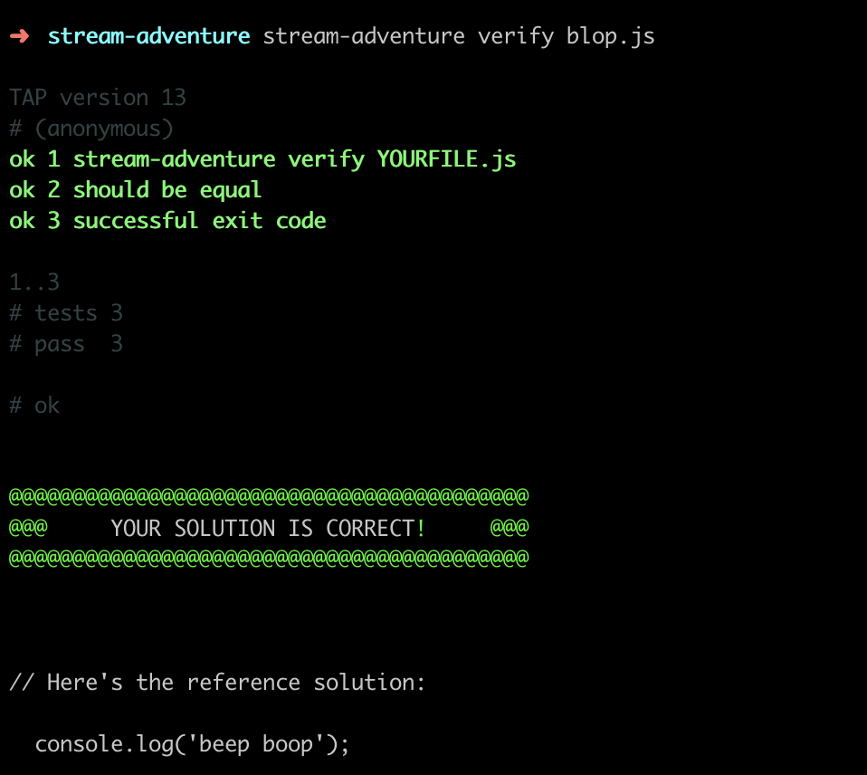
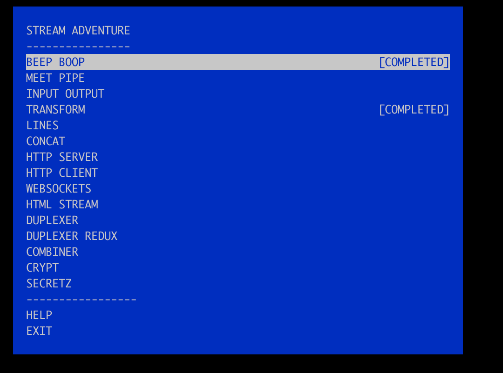

# April 4th, 2019

## Things discovered

* [Read about Node.js streams](https://nodejs.org/api/stream.html)
  * A stream is an abstract interface for working with streaming data in Node.js. The stream module provides a base API that makes it easy to build objects that implement the stream interface
  * Types of streams: Writable, Readable, Duplex (r+w), Transform (modify duplex)
* [Playing around with streams](https://github.com/workshopper/stream-adventure/)
  * Different examples accessible via  CLI
  * `$ npm i -g stream-adventure`
  * `$ stream-adventure`
  * chose example [1]
  * get instructions for each example [2]
  * implement solution
  * verify via command [3]
  * once a exercise was finished successfully finished, it will be shown as completed [4]
* Future learnings can be made by [workshopper organization](https://github.com/workshopper)

## Additional attachments

[1]

[2]

[3]

[4]

