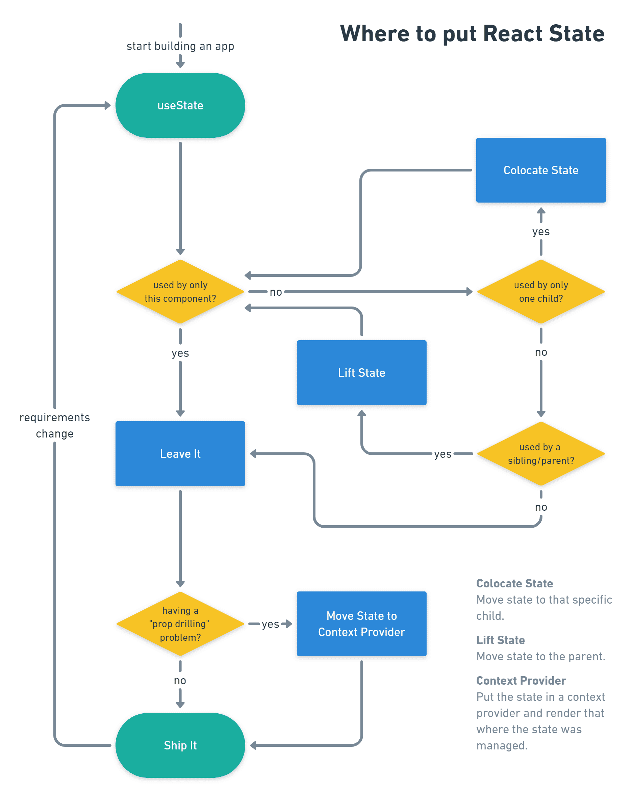

# September 26th, 2019

## Things discovered

* [State Colocation will make your React app faster](https://kentcdodds.com/blog/state-colocation-will-make-your-react-app-faster)
    * When we manage the state higher up in the React component tree, every update to that state results in an invalidation of the entire React tree.
    * But if you move your state further down the React tree as we did with the dog state and the DogName component, then React has less to check
    * The principle of colocation is: `Place code as close to where it's relevant as possible` 

## Additional attachments

