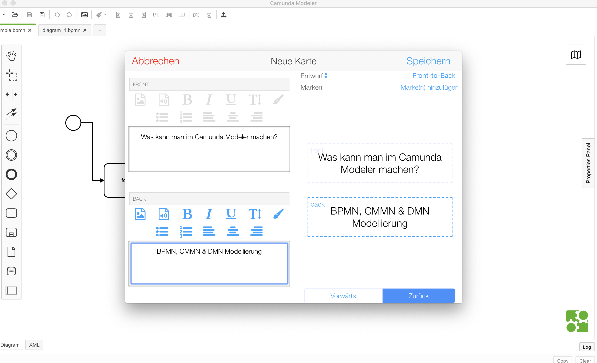
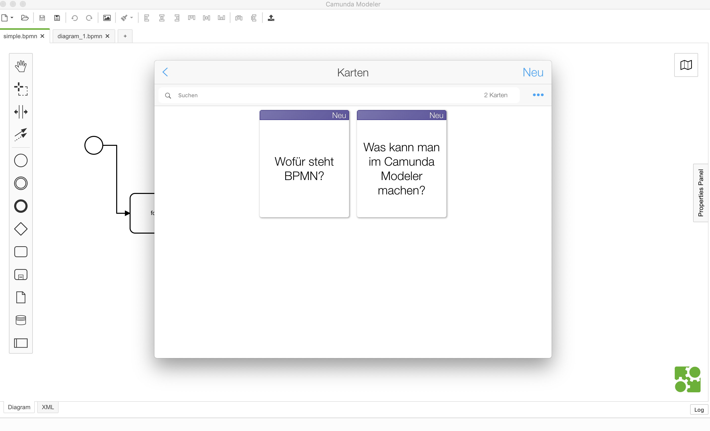
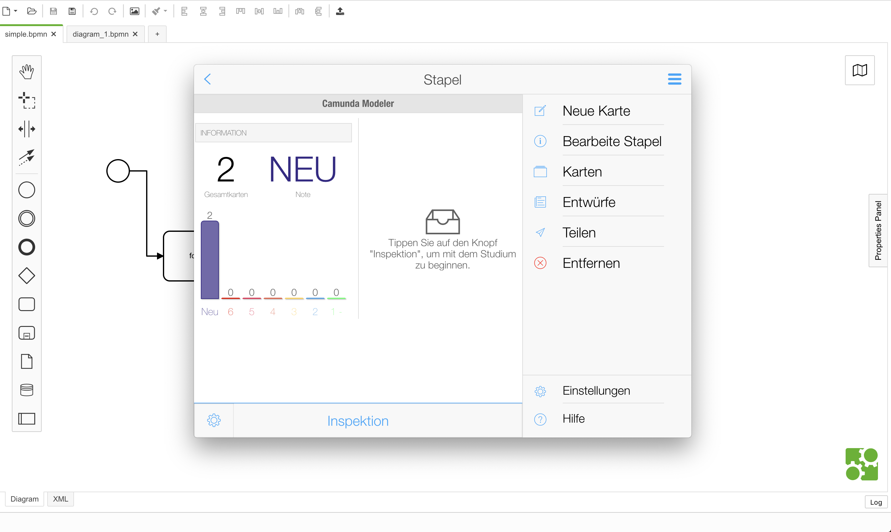

# February 27th, 2019

## Things discovered

* Read through some articles [Maciej](https://github.com/barmac) shared with us after his attendance at the 33rd [Node.js meetup in Berlin](https://www.meetup.com/de-DE/Node-js-Meetup-Berlin/events/258155531/).
* [Code faster by improving your long term memory](https://daliaresearch.com/blog-coding-long-term-memory/)
  * "I also noticed that I would often work on one system, become familiar with it, and then not touch that system for several months. Meanwhile, I’d forgotten every detail about it, and when I came back later, I had to relearn everything. It was horribly inefficient."
  * Using [flashcard](https://de.wikipedia.org/wiki/Lernkartei) systems
  * "I would then review these cards daily, finding that keeping these items at the forefront of my memory let me understand concepts related to them as well."
  * "Because I didn’t have to spend the energy thinking about the basic concepts, I could spend my effort on trying to solve the direct problem being discussed."
  * "Now, when I’m developing a new feature or fixing a bug, I leave all the browser tabs open as I work. Once I’m done, I review each tab, asking myself, “do I want to add this to my long term memory”? “Will I be likely to look this up again in the future?” When in doubt, I say yes."
  * [Anki](https://www.ankiapp.com/): Recommended Flashcard App
* Try out [Anki](https://www.ankiapp.com/)

  * UI is kind of confusing, but it's small
  * Nice statistics
  * Consider using it in upcoming concept creations or debugging sessions

